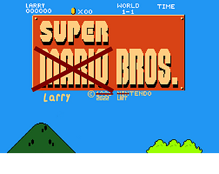
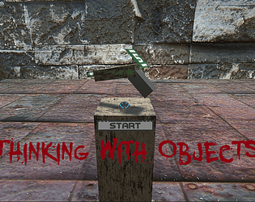
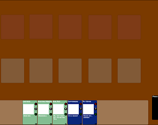
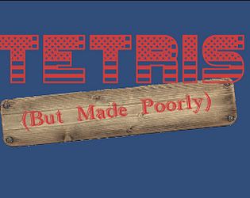
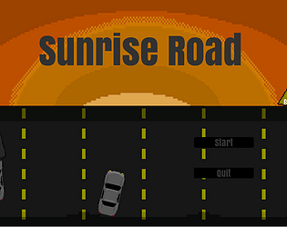

<!DOCTYPE html>
<html  >
<head>
  <!-- Site made with Mobirise Website Builder v6.1.12, https://mobirise.com -->
  <meta charset="UTF-8">
  <meta http-equiv="X-UA-Compatible" content="IE=edge">
  <meta name="generator" content="Mobirise v6.1.12, mobirise.com">
  <meta name="viewport" content="width=device-width, initial-scale=1, minimum-scale=1">
  <link rel="shortcut icon" href="assets/images/banner.png" type="image/x-icon">
  <meta name="description" content="">
  
  
  <title>Talon Game Studios</title>
  <link rel="stylesheet" href="assets/bootstrap/css/bootstrap.min.css">
  <link rel="stylesheet" href="assets/dropdown/css/style.css">
  <link rel="stylesheet" href="assets/theme/css/style.css">
  <link rel="preload" href="https://fonts.googleapis.com/css?family=Inter+Tight:100,200,300,400,500,600,700,800,900,100i,200i,300i,400i,500i,600i,700i,800i,900i&display=swap" as="style" onload="this.onload=null;this.rel='stylesheet'">
  <noscript><link rel="stylesheet" href="https://fonts.googleapis.com/css?family=Inter+Tight:100,200,300,400,500,600,700,800,900,100i,200i,300i,400i,500i,600i,700i,800i,900i&display=swap"></noscript>
  <link rel="preload" as="style" href="assets/mobirise/css/mbr-additional.css?v=WRR82t"><link rel="stylesheet" href="assets/mobirise/css/mbr-additional.css?v=WRR82t" type="text/css">

  
  
  
</head>
<body>
  
  <section data-bs-version="5.1" class="menu menu5 cid-v9r1to9px4" once="menu" id="menu05-0">
	

	<nav class="navbar navbar-dropdown navbar-fixed-top navbar-expand-lg">
		

			

				
					
				
				<a class="navbar-caption text-primary display-4" href="https://mobiri.se">Game Design Services</a>
			

			<button class="navbar-toggler" type="button" data-toggle="collapse" data-bs-toggle="collapse" data-target="#navbarSupportedContent" data-bs-target="#navbarSupportedContent" aria-controls="navbarNavAltMarkup" aria-expanded="false" aria-label="Toggle navigation">
				

					
					
					
					
				

			</button>
			

				<ul class="navbar-nav nav-dropdown nav-right" data-app-modern-menu="true"><li class="nav-item">
						<a class="nav-link link text-primary display-4" href="https://mobiri.se">Home </a>
					</li><li class="nav-item"><a class="nav-link link text-primary display-4" href="https://mobiri.se">About</a></li>
					<li class="nav-item">
						<a class="nav-link link text-primary display-4" href="https://mobiri.se" aria-expanded="false">Pricing </a>
					</li>
					<li class="nav-item">
						<a class="nav-link link text-primary display-4" href="https://mobiri.se">Contacts</a>
					</li></ul>
				
			

		

	</nav>
</section>

<section data-bs-version="5.1" class="start article4 cid-v9r1VMczVn" id="article04-1">
	

	
	

	

		

			

				
			

			

				

					<h1 class="mbr-section-title mbr-fonts-style mb-4 display-2">
						<strong>Game Design in the modern day</strong></h1>
					

						Here, we offer insights into game design, and our own services in game design through art, coding, music, and story.

					
<a class="btn btn-lg btn-success-outline display-7" href="index.html#header14-3">Get Started</a>

				

			

		

	

</section>

<section data-bs-version="5.1" class="features03 cid-v9r2MkT9V5" id="features03-2">
	
	
	

		

			

				

					<h4 class="mbr-section-title mbr-fonts-style align-center mb-0 display-2"><strong>Our Features</strong></h4>
					
				

			

		

		

			

				

					

						
					

					

						<h5 class="item-title mbr-fonts-style mt-0 mb-2 display-5"><strong>Coding</strong></h5>
						

						    We do the coding for the game as instructed and prompted by the client.

						
					

				

			

				

					

						
					

					

						<h5 class="item-title mbr-fonts-style mb-2 mt-0 display-5">
							<strong>Art/Music/Story</strong></h5>
						
We create the art through out in house specialists to add an increased atmosphere to the game.

						
					

				

			

				

					

						
					

					

						<h5 class="item-title mbr-fonts-style mb-2 mt-0 display-5">
						    <strong>Quick Responses</strong></h5>
						

						We pride ourselves on how quick we respond to inquiries, as well as get projects finished and speak to the client. 
						

						
					

				

			

			
			
		

	

</section>

<section data-bs-version="5.1" class="header14 cid-v9r2RX15rz" id="header14-3">
	

	
	
	

		

			

				

					

						<h1 class="card-title mbr-fonts-style mb-4 display-2">
							<strong>Get your ideas realized&nbsp;</strong></h1>
						

							Press the start button, and give your information and any information necessary and we will respond to you within 1-2 business days.

						
<a class="btn btn-warning display-7" href="https://mobiri.se">Start Now</a>

					

				

			

		

	

</section>

<section data-bs-version="5.1" class="gallery4 cid-v9r31gnMtl" id="gallery04-4">
  
  
  

    

      

        

          <h4 class="mbr-section-title mbr-fonts-style align-center mb-0 display-2">
            <strong>Past Projects</strong></h4>
          <h5 class="mbr-section-subtitle mbr-fonts-style align-center mb-0 mt-4 display-7">
            These are previous project examples from clients we have worked with before.</h5>
        

      

    

    

      

        

          
        

        

          
        

        

          
        

        

          
        

      

      

        

          
        

        

          
        

        

          
        

        

          
        

      

    

  

</section>

<section data-bs-version="5.1" class="footer2 cid-v9xyt5Ij1j" once="footers" id="footer02-5">
    

    
    

    

        

            

                

                    © Copyright 2030 Mobirise - All Rights Reserved
                

            

            

                

                    <ul class="row-links-soc">
                        
                        
                        
                        
                    <li class="row-links-soc-item mbr-fonts-style display-7">
                            <a href="#" class="text-primary">Instagram</a></li><li class="row-links-soc-item mbr-fonts-style display-7">
                            <a href="#" class="text-primary">TikTok</a>
                        </li><li class="row-links-soc-item mbr-fonts-style display-7">
                            <a href="#" class="text-primary">YouTube</a>
                        </li><li class="row-links-soc-item mbr-fonts-style display-7">
                            <a href="#" class="text-primary">Twitter</a>
                        </li><li class="row-links-soc-item mbr-fonts-style display-7">(586) 123 4567</li></ul>
                

            

        

    

</section><section class="display-7" style="padding: 0;align-items: center;justify-content: center;flex-wrap: wrap;    align-content: center;display: flex;position: relative;height: 4rem;">
&#8204;
<a style="z-index:1" href="https://mobirise.com/html-builder.html">HTML Generator</a></section>            
  
  
</body>
</html>
